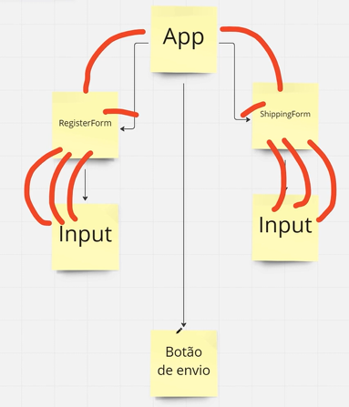
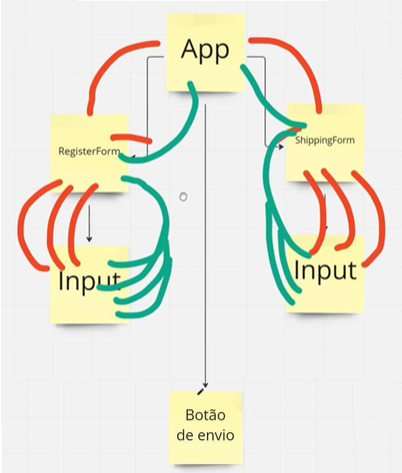

## Conheça o problema de prop drilling

Estamos iniciando a nossa primeira aula. Nesse momento, dê play na videoaula para:

- entender o conceito de prop drilling;
- identificar situações em que os dados e as funções precisam ser passados repetidamente entre componentes;
- explorar diferentes abordagens para resolver o problema de prop drilling;
- compreender como o Flux resolve o problema de prop drilling.

### Crie formulários

Acompanhe as maneiras de construir um formulário com React:

- Tudo em um componente.
- Um componente para o cadastro e outro para a entrega.
- Um componente para os campos, botões e para cada um dos formulários um componente isolado.

### Compartilhe o estado

O componente principal App teria que ser o “dono” do estado e através de propôs iria passar o estado e as funções para manipulá-lo.

### Prop drilling

### Links úteis

- [Redux Toolkit](https://redux-toolkit.js.org/)

- [Repositório usado no módulo](https://github.com/ogiansouza/ebac_games_redux)
