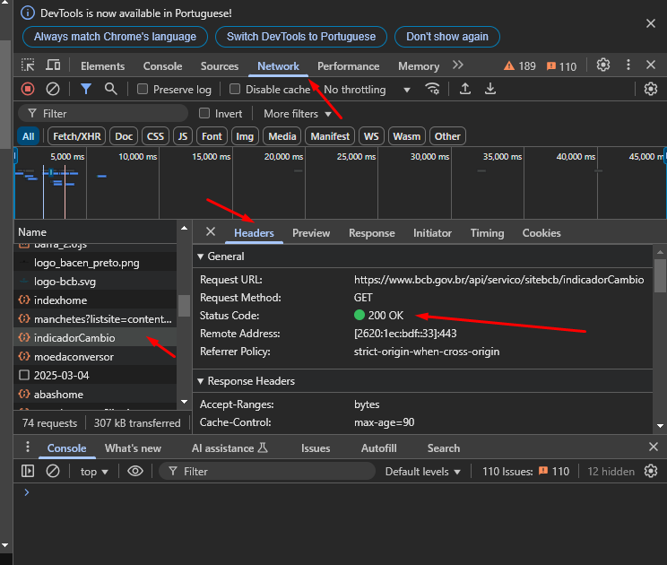

Estamos iniciando a nossa primeira aula. Nesse momento, dê play na videoaula para:

conceituar e entender a estrutura de URL;
definir e compreender a estrutura de HTTP;
compreender os conceitos fundamentais da comunicação entre o frontend e o backend;
familiarizar-se com os métodos HTTP.
